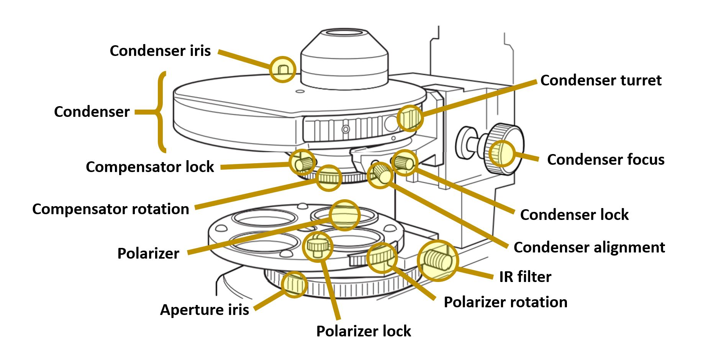
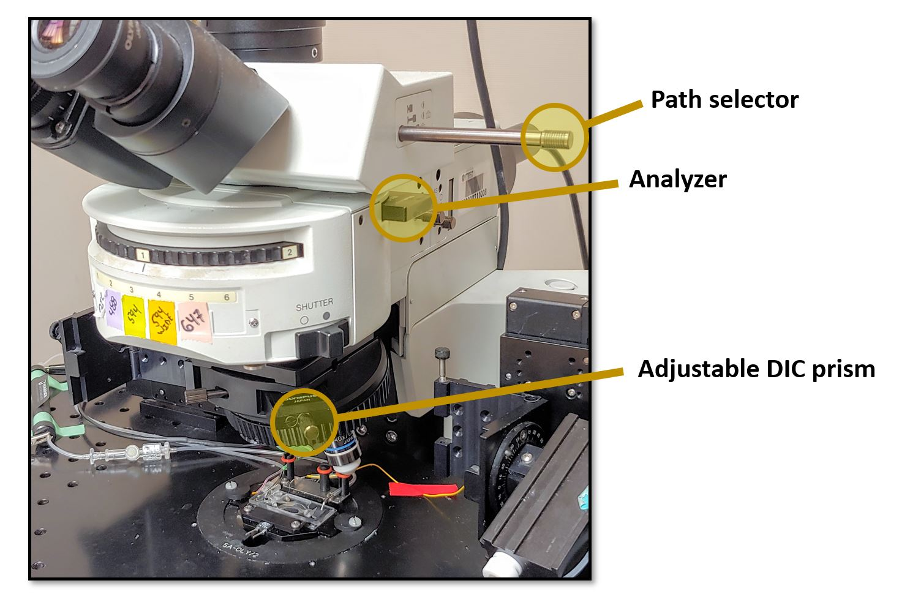
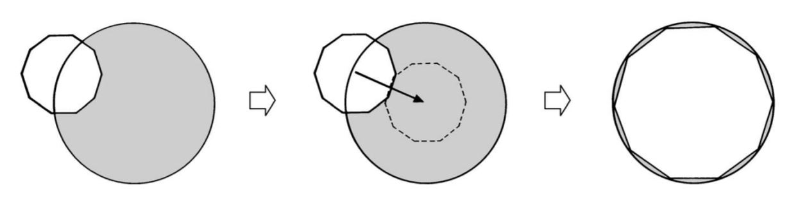
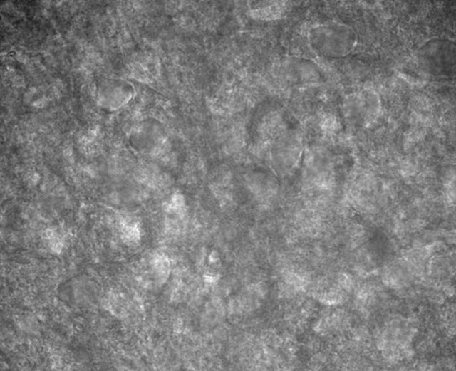
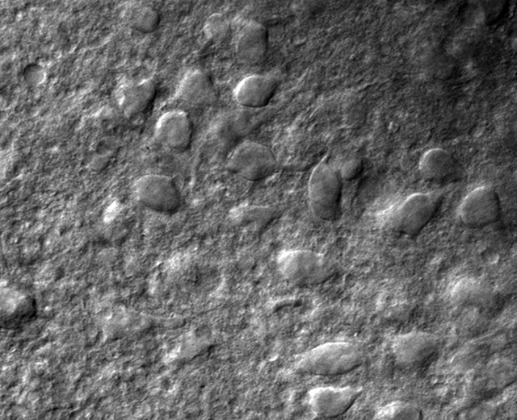

# Olympus BX51WI DIC Alignment 

This page is a cheat sheet guide for quickly aligning DIC optics. Read the [full BX51WI manual](../../files/bx51-manual.pdf) for more complete information.

Lower Components|Upper Components
---|---
|

## Prepare the light path
  * remove `adjustable DIC prism`
  * remove `condenser` (loosen the `condenser lock`)
  * insert `IR filter`
  * insert `lower polarizer`
  * insert `analyzer`
  * insert `10x objective`
  * Ensure the `path selector` is fully out (all light to camera)
  * fully open `aperture iris` (clockwise)

> **Check for Camera Dirt:** If there are black spots on the image it is likely because the glass covering the CCD sensor on the camera requires cleaning. Cleaning can be achieved using a lens cloth and compressed air.

> **Inspect the condenser filters:** The condenser contains 1 or more DIC filters you can rotate in or out of the light path using the `condenser turret`. These filters are matched to specific lenses. Ensure you can identify turret positions where the filter is in the light path (`DIC`) and out of the light path (`brightfield`).

## Align the Polarizer and Analyzer
* Insert `lower polarizer` into the light path
* Loosen the `polarizer lock`
* Adjust `polarizer rotation` to minimize light intensity
* Tighten the `polarizer lock`

## Adjust the Compensator
* Insert the `condenser` and tighten the `condenser lock`
* Rotate the `condenser turret` to select `DIC`
* Loosen the `compensator lock`, rotate `compensator` to minimize light, then tighten `compensator lock` again

## Align the DIC prisms
* Rotate `condenser turret` to select `brightfield`
* Insert the `adjustable DIC prism` and adjust to minimize light

## Align the Condenser
* Place a small object in the stage (like the slice anchor basket) and focus the objective on it with a low power lens.
* Move the stage so the object is no longer in the field of view.
* Maximally open the `condenser iris` (pull level toward you)
* Maximally close the `aperture iris` (rotate counterclockwise)
* Focus the `condenser` until a sharp decagon appears in focus
* Slowly open the `aperture iris` until the decagon is as large as it can be while still being able to see all its sides.
* Center the decagon in the view by adjusting the `condenser alignment` screws
* Enlarge the decagon and repeat until each of the decagon’s corners touch the edge of the field of view
* Repeat with the 40x immersion lens

## Prepare for Brain Slice Imaging
* Fully open the `aperture iris`
* Fully open the `condenser iris` and focus on a brain slice
* Ensure the condenser is set to `DIC` (not `BF`)
* Set `adjustable DIC prism` to darkest point
* Rotate `adjustable DIC prism` counterclockwise until image looks good (about 1/2 turn)

## Example Images

These images are the same section of a 300 µm thick brain slice containing basolateral amygdala imaged before/after alignment.

Bad Alignment | Good Alignment
---|---
|
